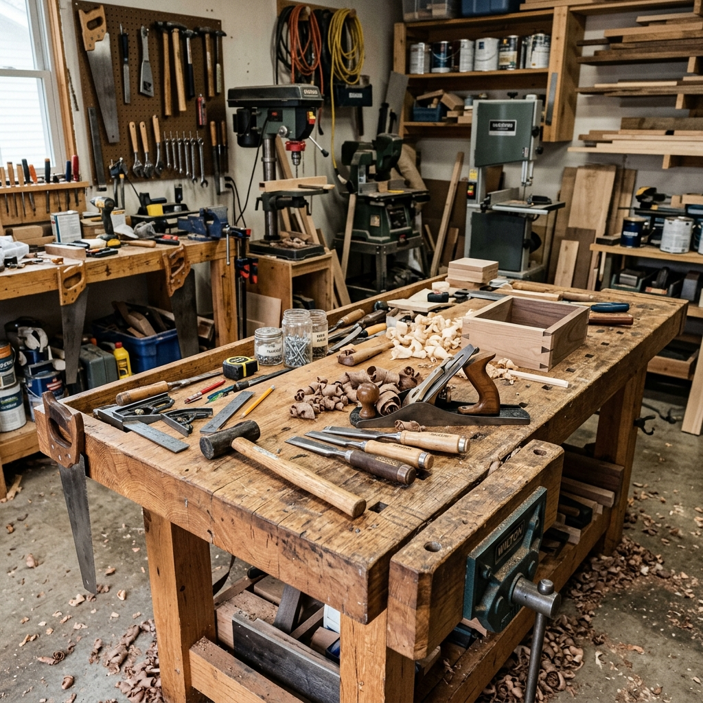

After years of working on a wobbly bench, I finally built something that doesn’t move when I’m planing or chopping mortises. The design is a hybrid: European-style base with a thick laminated hardwood top and a leg vise on one end.

Lamination was the most time-consuming step. I jointed and glued 2" maple in sections, then ran the top through the planer until it was dead flat. The base is mortise-and-tenon with wedged through-tenons at the stretchers so it can be knocked down if we ever move.

The bench is 72" long and 24" deep—enough for most furniture work without dominating the garage. Next up: adding a sliding deadman and a tool well.
