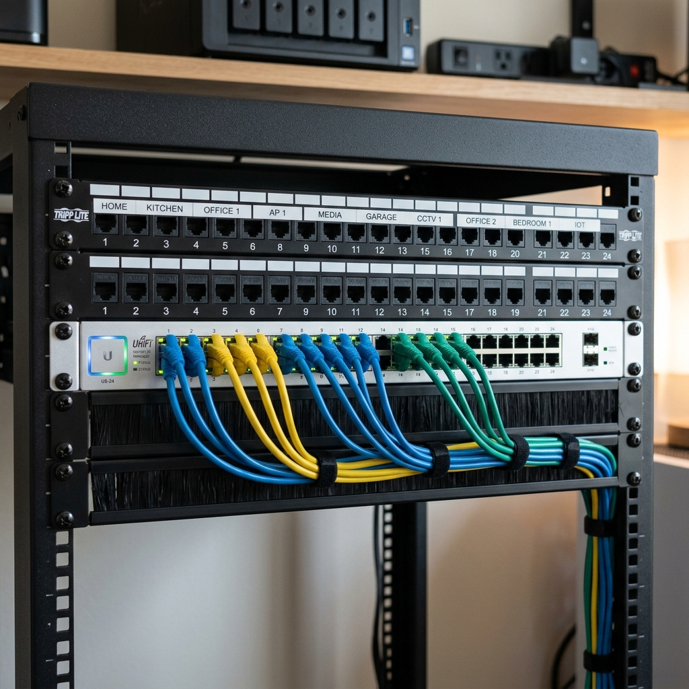

I wanted one place for family photos, backups, and a few self-hosted services—without paying a cloud tax every month. So I turned an old desktop and some spare drives into a simple home server running TrueNAS (now Scale) in a VM and Docker for everything else.

The host is a refurbished business PC with an i5 and 32GB RAM. I added a multi-bay enclosure for the data drives and set up ZFS mirroring for the important datasets. Backups go to the NAS from our laptops on a schedule; photos and media are served to the rest of the house over the LAN.

I run Pi-hole in a container for network-wide blocking, plus a couple of small web apps. Everything backs up to an external drive weekly. Power draw is low, and the whole setup lives in a closet with decent airflow.
