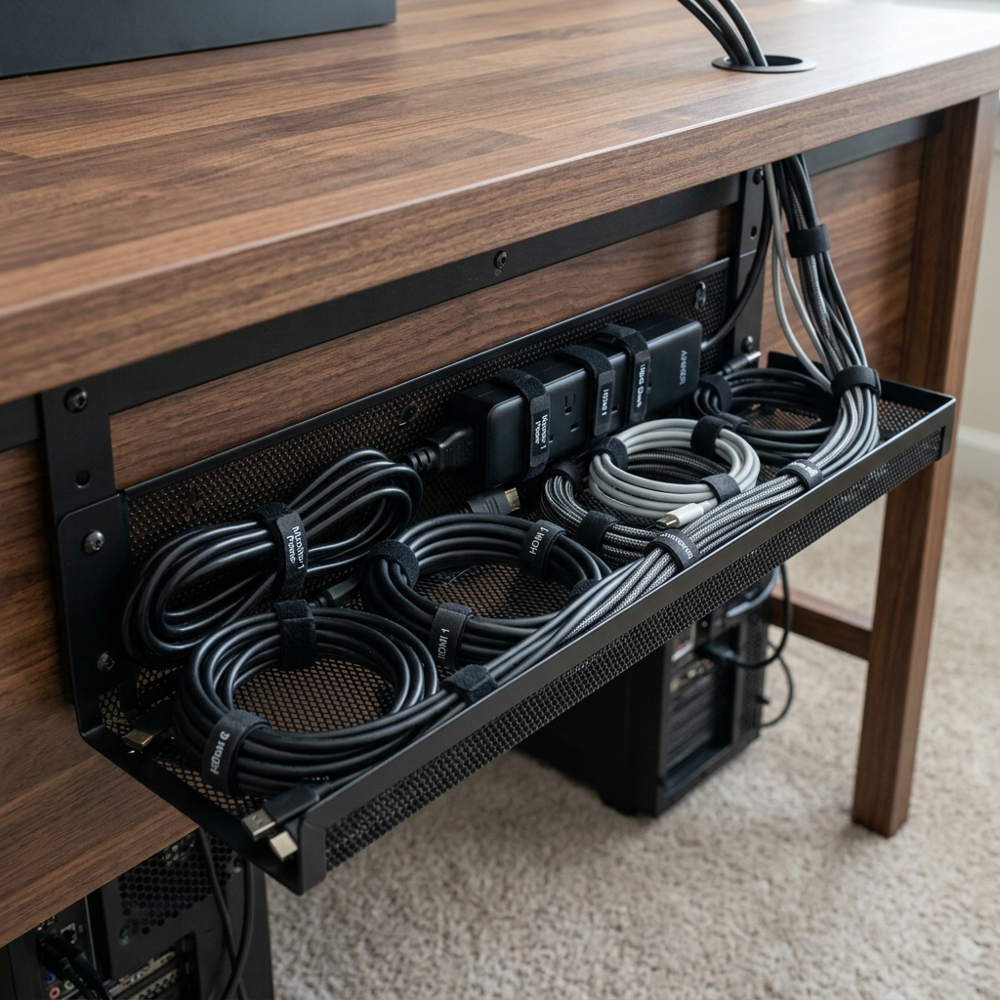

Wires were everywhere: monitors, laptop, lamp, speakers, and a tangle of USB and power. I wanted one clean run to the wall and nothing dragging on the floor. Here’s what worked.

I mounted a metal cable tray under the desk and ran all cables through it toward one corner. A single power strip lives in the tray; the laptop and peripherals plug into a powered USB hub so only the hub cable and power cord go down to the outlet. Velcro straps every few inches keep everything in place.

I added a short extension for the desk lamp and labeled the power strip so I can kill everything with one switch. Under-desk is now invisible from the sitting side, and unplugging for a move is straightforward.
