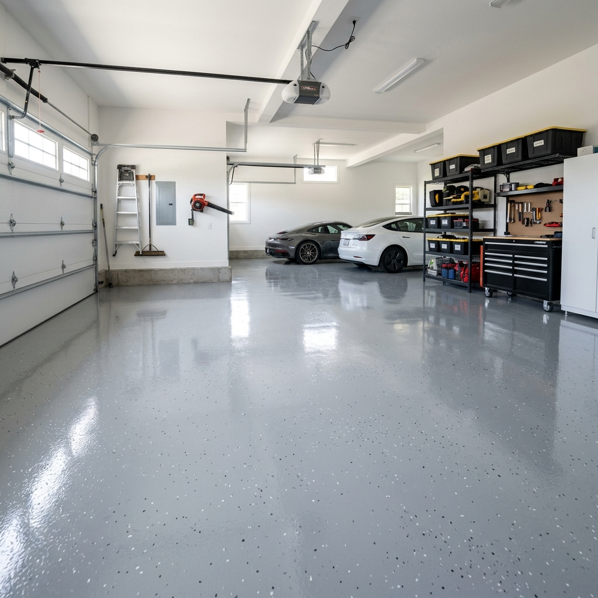
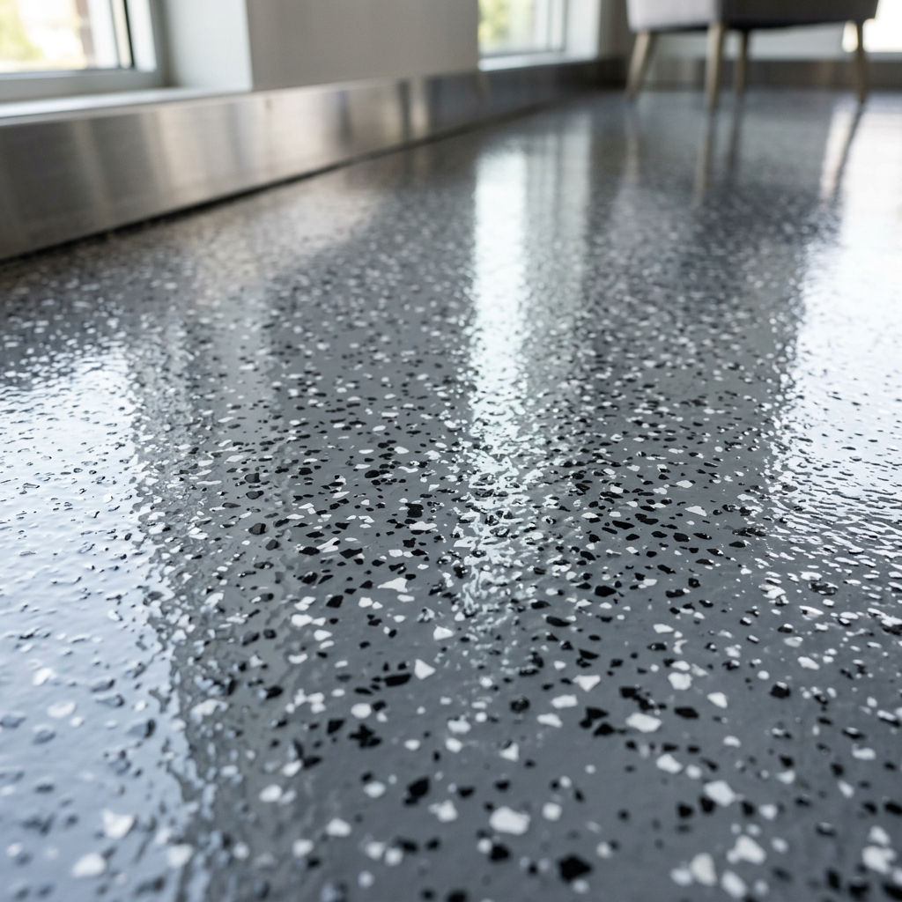

The garage slab was stained and dusty. I wanted something that would shrug off oil, sweep easily, and look like a real shop floor. A two-part epoxy system with decorative flakes fit the bill.

Prep was most of the work: pressure wash, etch with acid, fill cracks, and let it dry for a few days. I used a kit that included primer, color base, and clear topcoat. After the primer cured, I rolled the base coat and broadcast the flakes by hand so the coverage was even. The next day I swept off loose flakes and applied the topcoat.

The floor has held up to jack stands, spills, and winter salt. Sweeping and occasional mopping keep it clean. If I did it again, I’d rent a concrete grinder for any really rough spots before priming.
