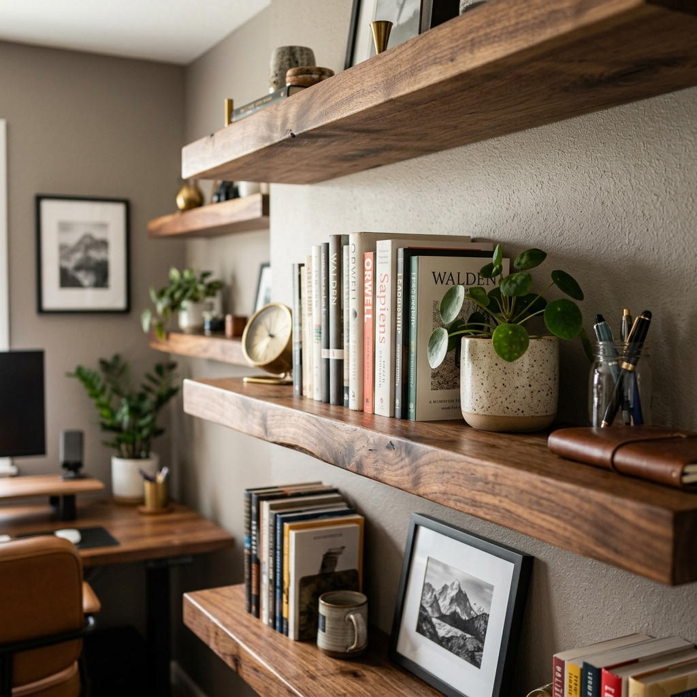

The home office needed storage that didn’t crowd the desk. I built three floating shelves out of 1x8 maple and mounted them on heavy-duty hidden brackets so they read as clean slabs on the wall.

Each shelf is a single board, sanded and finished with wipe-on poly. The brackets bolt into studs; the shelf slides over the bracket and is pinned from below so there are no visible fasteners from the front. I used a level and a story stick to keep the spacing even.

They hold books, a few plants, and some small gear. The look is minimal and the office feels bigger. Next time I’d make the shelves a bit deeper for larger binders.
