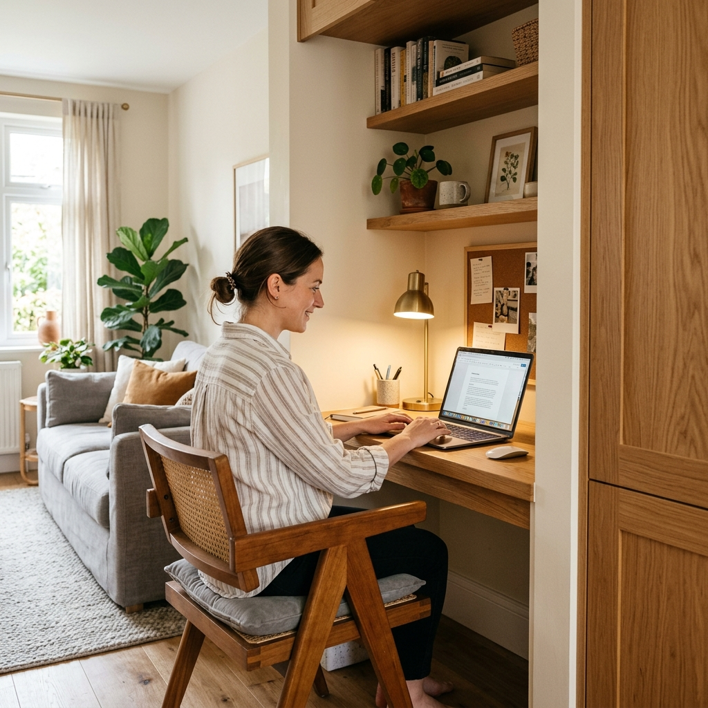

We had a corner by the stairs that collected junk. We turned it into a small study nook: a built-in desk, a few shelves, and an outlet strip so a laptop and lamp don’t need extension cords.

The desk is a 1" hardwood top on a simple base—two sides and a center support, all painted. The shelves above are 1x8 on brackets, same finish as the trim. I ran a single circuit to a quad outlet behind the desk and added a small LED task light.

It’s now the default spot for homework and video calls. The nook feels intentional instead of leftover space, and we didn’t have to give up a whole room.
