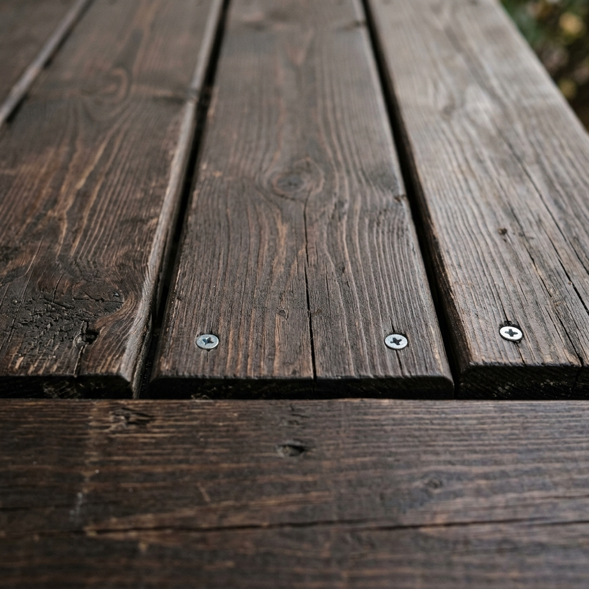

The deck was gray and splotchy. We wanted color and UV protection without hiding the grain. So we cleaned it, applied a brightener, and put down two coats of semi-transparent oil-based stain.

First pass was a deck cleaner and a stiff brush; then we rinsed and let it dry. The brightener brought the wood back to a consistent tone. After another rinse and a couple of dry days, we rolled and brushed the first coat of stain, waited 24 hours, and applied the second. We did the railings with a brush for control.

A year in, the color has held and water still beads. We’ll re-coat in another year or two depending on wear. Doing it in July gave us long dry times and no frost risk.
