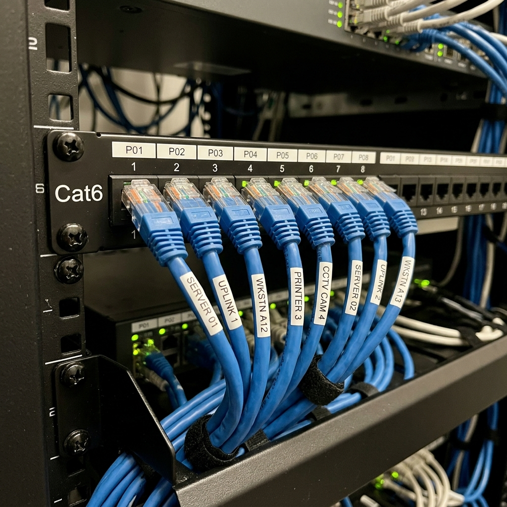

We had Cat6 in the walls but no central place to land it. I added a small wall-mount rack in the utility room with a patch panel, a PoE switch, and a patch cable to the router. Now every drop is labeled and everything is in one place.

The panel has 24 ports; I punched down the room cables and ran short patch cables to the switch. The router sits above the rack and connects to the switch; the modem is nearby. Cable management bars keep the front tidy and make it obvious which patch goes where.

We have wired backhaul for mesh nodes, a drop for the office, and one for the TV. Speeds are solid and I didn’t have to run new cable—just terminate and organize.
