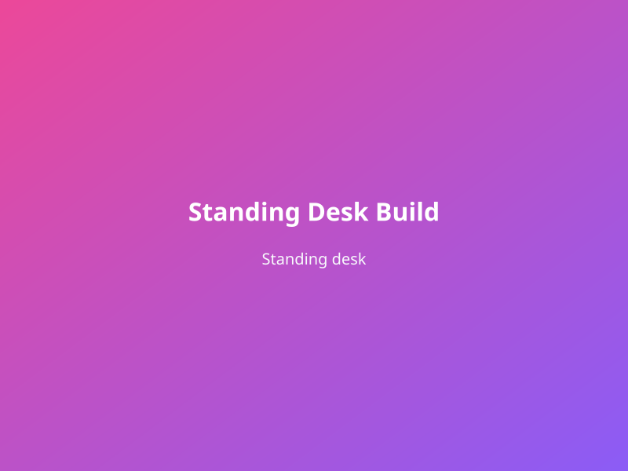
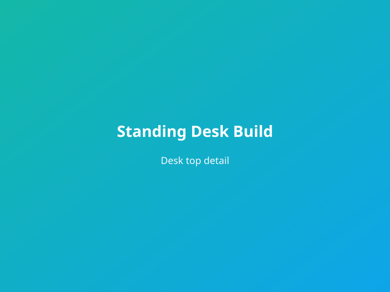

I wanted a standing desk with a real wood top and a frame that could go up and down without sway. I bought a dual-motor frame and built a 1.5" thick hardwood top to bolt to it.

The top is two layers of 3/4" maple edge-glued and face-glued, then planed and sanded. I rounded the edges with a router and finished with oil and wax. The frame’s mounting plate required a few holes; I drilled and counterbored so the bolts sit flush. Cable management runs through a grommet and under the desk.

The desk goes from 28" to 48" and stays stable at full height. The top is 60x30"—enough for two monitors and keyboard. Total cost was less than a comparable prebuilt, and the top can be refinished or replaced if we move.
