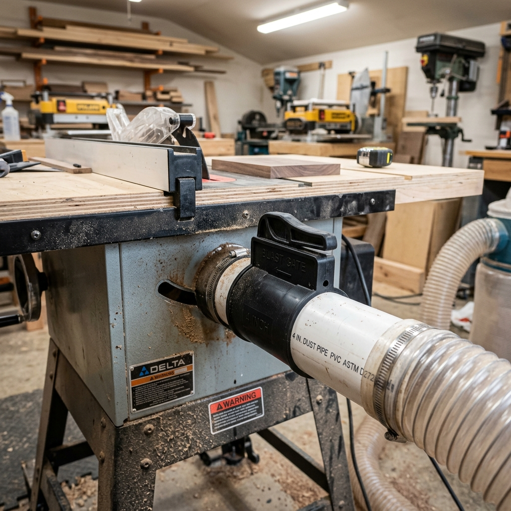

The shop vac was fine for hand tools but not for the table saw, planer, or router table. I upgraded to a 2HP collector and ran 4" PVC duct around the shop with blast gates at each drop.

The collector sits in a corner with a short run to the first branch. I used schedule 40 PVC and proper HVAC fittings; each drop has a blast gate so I only open the one for the tool in use. The table saw and planer get 4" flex to the cabinet ports; the bandsaw and router table share a branch with a wye.

The difference is huge. Chips and fine dust go to the collector instead of the room. I still wear a mask for long sessions, but the air stays much cleaner and cleanup is faster.
