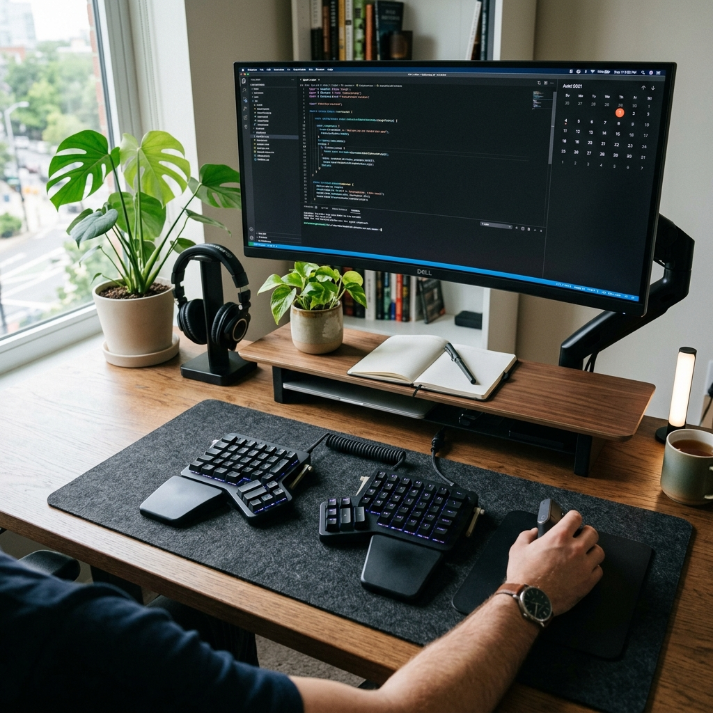
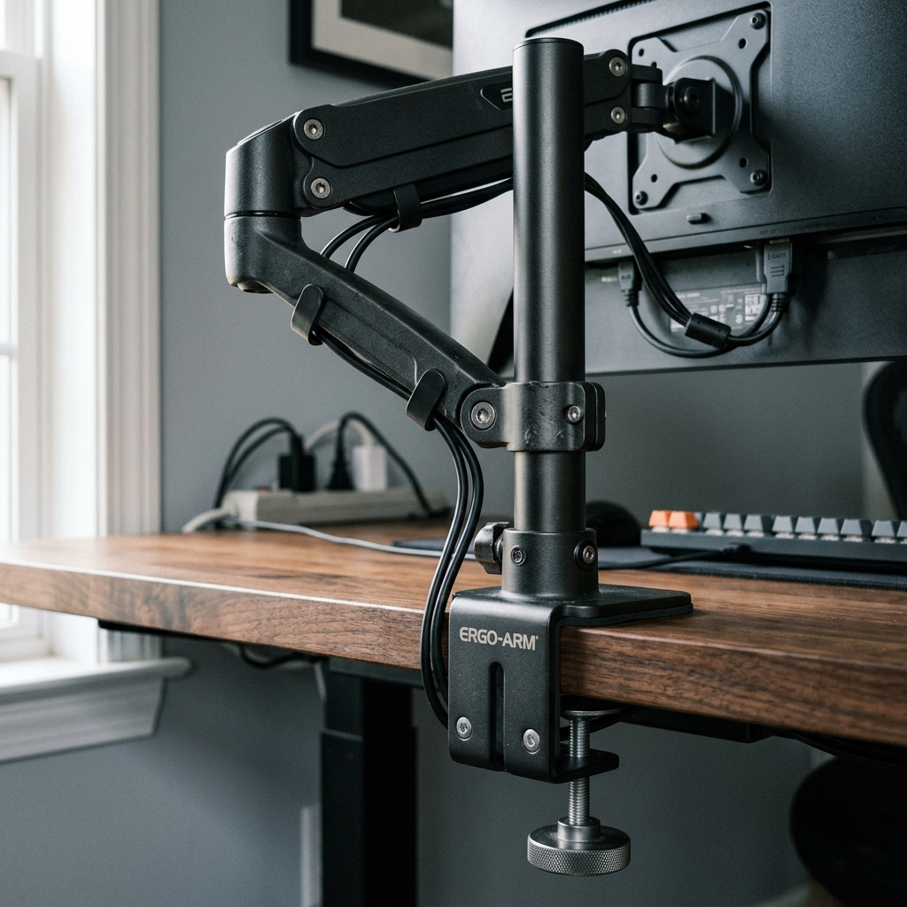

I was craning my neck at a laptop and a single monitor. I switched to dual monitor arms, a keyboard tray, and a few simple rules so the setup is adjustable and easier on my back and wrists.

I mounted two gas-spring arms on the desk and set the monitors at eye level, slightly tilted. The keyboard and mouse sit on a low tray so my elbows stay near 90°. The laptop is off to the side on a stand and used as a third screen when needed. I ran the cables through the arms and under the desk so nothing hangs.

A footrest and a decent chair rounded it out. I don’t get the same neck and shoulder fatigue after long days, and the arms make it easy to tweak position without moving the whole desk.
