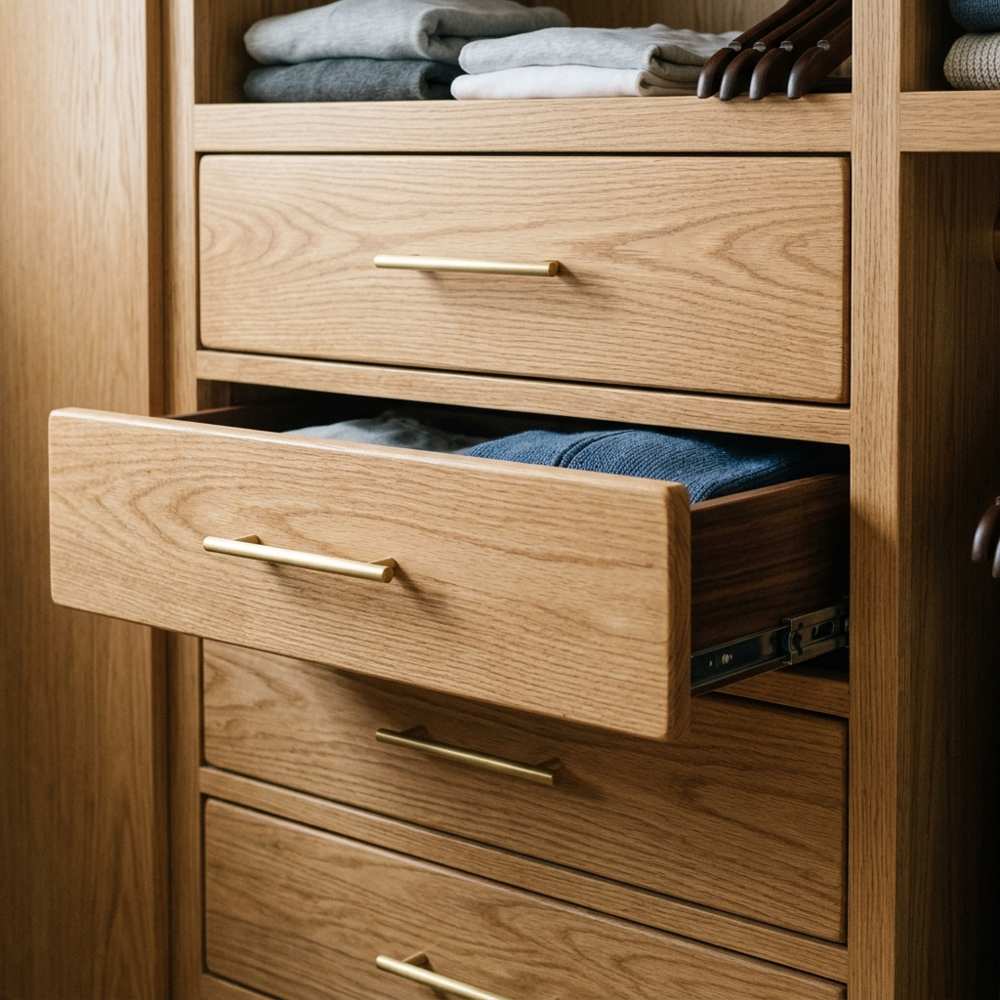

The master closet had a single wire shelf and rod. We wanted more hanging space, drawers, and shelves we could actually use. So we tore out the wire and built a custom layout with 3/4" ply and hardwood face frames.

We split the closet into zones: double hang on one side, long hang on the other, and a bank of drawers in the middle. Shelves above the rods for bins and out-of-season stuff. Everything is painted to match the room; drawer fronts are 1x4 with simple pulls.

We gained a lot of usable space and the closet finally feels intentional. Build took about a week of evenings; the most tedious part was getting the drawer boxes square.
